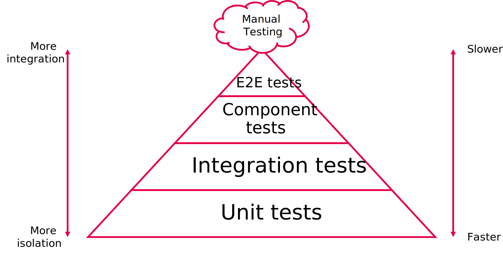

# Spring Testing

Choosing an effective software testing strategy is a highly subjective matter: different software
development teams disagree on the best strategy to employ and what to call every kind of test.
In this course, we're going to employ the following test pyramid:

We'll touch on End-to-End tests in sprint 3, but Sprint 1 only involves the unit tests, integration tests
and component tests. You may encounter different pyramids that have a different number of layers, or different
names for different layers. This, however, is the one *we* will be using for the purposes of this course.

## Test pyramid

The following article is quite lengthy, but provides a good overview of the test pyramid:

- [Practical Test Pyramid](https://martinfowler.com/articles/practical-test-pyramid.html).
  Note that this article uses the name "REST API End-to-End Test" for the type of test
  *we* call a "component test".

There's a link in that article that links to a page about the "test ice-cream cone", but it's broken.
You can find it here:

- [Testing Pyramids & Ice-Cream Cones](https://alisterscott.github.io/TestingPyramids.html)

## Unit tests

The following pages provide information about unit testing Spring Boot applications:

- [Spring Boot Unit Testing](https://www.arhohuttunen.com/spring-boot-unit-testing/)
- [Unit Testing with Spring Boot](https://reflectoring.io/unit-testing-spring-boot/)

## Integration tests

### HTTP integration tests

By HTTP integration tests, we mean tests that only test how API requests are handled by our controllers.
We don't involve the rest of the backend, like the service layer, though, so be sure to mock your service
classes!

The following articles can help you get started with HTTP integration tests:

- [Testing Web Controllers with Spring Boot @WebMvcTest](https://www.arhohuttunen.com/spring-boot-webmvctest/)
- [@MockitoBean and @MockitoSpyBean](https://docs.spring.io/spring-framework/reference/testing/annotations/integration-spring/annotation-mockitobean.html)
- [Testing MVC Web Controllers with Spring Boot and @WebMvcTest](https://reflectoring.io/spring-boot-web-controller-test/)
- [Testing the Web Layer](https://spring.io/guides/gs/testing-web)

### Database integration tests

By database integration tests, we mean tests that only test how our backend interacts with the database: do our
(auto-generated or manually written) queries do what we want them to do? With database integration tests you
need to be particularly careful to ensure that your tests can run independently of each other: every modification
needs to be rolled back!

The following articles provide useful information about database integration testing with Spring:

- [Testing the Persistence Layer with Spring Boot @DataJpaTest](https://www.arhohuttunen.com/spring-boot-datajpatest/)
- [Testing JPA Queries with Spring Boot and @DataJpaTest](https://reflectoring.io/spring-boot-data-jpa-test/)

## Backend component tests

By component test, we mean a test that tests one component as a whole. In our case we want to test the entire backend
component. We're using the term component test for this because that's what these kinds of tests are often called
in distributed applications. These are also sometimes referred to as "REST API End-to-End tests", broad integration tests
or system tests.

What *we*'re looking for in a component test is a test that actually runs a full backend (`@SpringBootTest(webEnvironment = SpringBootTest.WebEnvironment.RANDOM_PORT)`) and performs real (non-mocked) HTTP requests. We want to test every layer of our
backend, so there's generally no mocking involved in these kinds of tests.

Just like with database integration tests, you will need to be particularly careful that your tests can run independently
of each other, and that any modifications to the database are rolled back.

The following articles provide useful information about how we can test our entire backend:

- [Spring Boot Integration Testing with @SpringBootTest](https://www.arhohuttunen.com/spring-boot-integration-testing/).
  Note that this article talk about "broad integration tests" or "end-to-end tests" for the type of tests *we* call
  "component tests".
- [Testing with Spring Boot and @SpringBootTest](https://reflectoring.io/spring-boot-test/)

## Tests with Spring Security

When you're writing backend component or HTTP integration tests you may
run into 401/403 errors. You can either use `@WithMockUser` (only if
requests are mocked) or use the `JwtService` to generate JSON Web Tokens
and provide the appropriate `Authorization` header when performing your request.

Here are some useful sources to help you on your way:

- [Testing Method Security](https://docs.spring.io/spring-security/reference/servlet/test/method.html)
- [Spring Security for Spring Boot Integration Tests](https://www.baeldung.com/spring-security-integration-tests)
