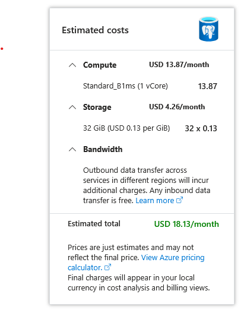

# PostgreSQL Database

## 1. Acceptance Criteria

Currently the backend of the application uses H2 as a database.

This should change to the following:

* When running locally, the backend uses H2
* The backend's tests run on H2
* The production environment backend uses a production schema in a dedicated PostgreSQL database

## 2. Implementation Details

### 2.1. Setup the PostgreSQL database

There are two alternatives: you can either use PostgreSQL on Azure (option A) or use another PostgreSQL service (option B).

#### 2.1.A. Azure Database for PostgreSQL

Use "Azure Database for PostgreSQL" to set-up a PostgreSQL database. Make sure to create the database via Azure For Students so you can profit from a free PostgreSQL database:

* Click on "Education" under "Azure Services" to go to the Azure for Students homepage
* Click on "Explore All" under "Free Services"
* Under "Azure Database for PostgreSQL" it should say "750 hours of Flexible Server -- Burstable B1MS Instance, 32 GB storage, and 32 GB backup storage". Make sure that when you create this resource that it matches the free allowance. Click "Create".
* For region, try to provision under "West Europe" or "France Central"
* Select "PostgreSQL version 17"
* Select "Development" as Workload Type
* Make sure that you configure the cheapest development configuration under "Compute + Storage", or your free compute hours and your free credits will not suffice for the database costs:
  * Compute tier should be "Burstable ..."
  * Compute size should be "Standard_B1ms ..."
  * Storage type should be "Premium SSD"
  * Storage Size should be "32GB"
  * Performance Tier should be "P4 (120 iops)"
  * Leave "Storage Auto-growth" disabled
  * Disable "High Availability"
  * The cost overview should show something like the following picture:
    
    The actual cost should be free (included in
    the monthly free allowance of Azure for Students).
* Under "Authentication"
  * Select "PostgreSQL authentication only"
  * Choose (and store!) your Admin username and password
* Go to the Networking tab
  * Select "Public Access" under Connectivity method
  * Check the checkbox "Allow public access to this resource through the internet using a public IP address"
  * Add your current client IP so you can access the database from your laptop via pgAdmin.
    If you move to a new IP address you'll have to add it to the Firewall rules.
  * Under "Firewall rules" check the checkbox "Allow public access from any Azure service within Azure to this server".
    This should allow our backend to reach the PostgreSQL server.
* Click "Review + create"

#### 2.1.B. Using another PostgreSQL hosting service

You are free to choose another alternative instead. One such alternative is [Neon](https://neon.com/).

### 2.2. Connect to PostgreSQL in production

Your app should do different things depending on where it is ran:

* When ran locally or during tests, it uses H2
* When ran in production, it uses PostgreSQL.

Using a different database depending on where your app is ran can be accomplished using [Spring Profiles](./../../../reference/spring-profiles/1%20-%20spring-profiles.md).

Create a profile for each environment and give them the properties to start, or connect to, the right database. You can find connection details for your Azure Database by navigating to the resource, and then clicking on the "Connect" tab under "Settings".

You can enable the right Spring profile in Azure by using an environment variable. 

There should be no changes to your app when ran locally or when running tests.

On Azure - "in production" - the app will probably crash. We will tackle this in [the next task](./2-schema-management.md).
